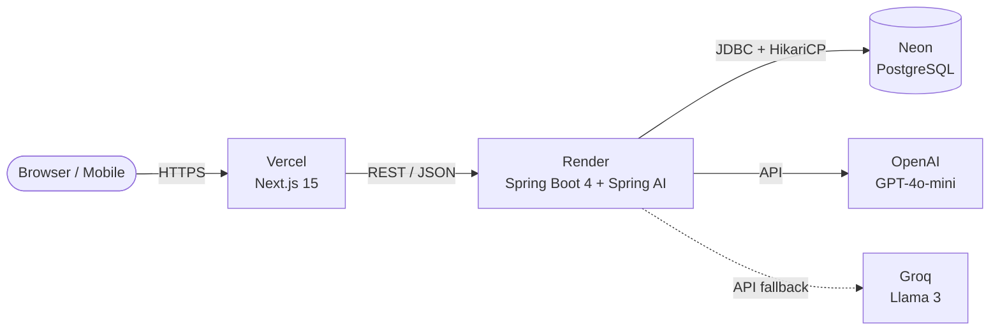
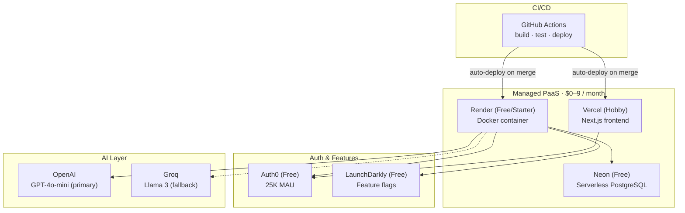
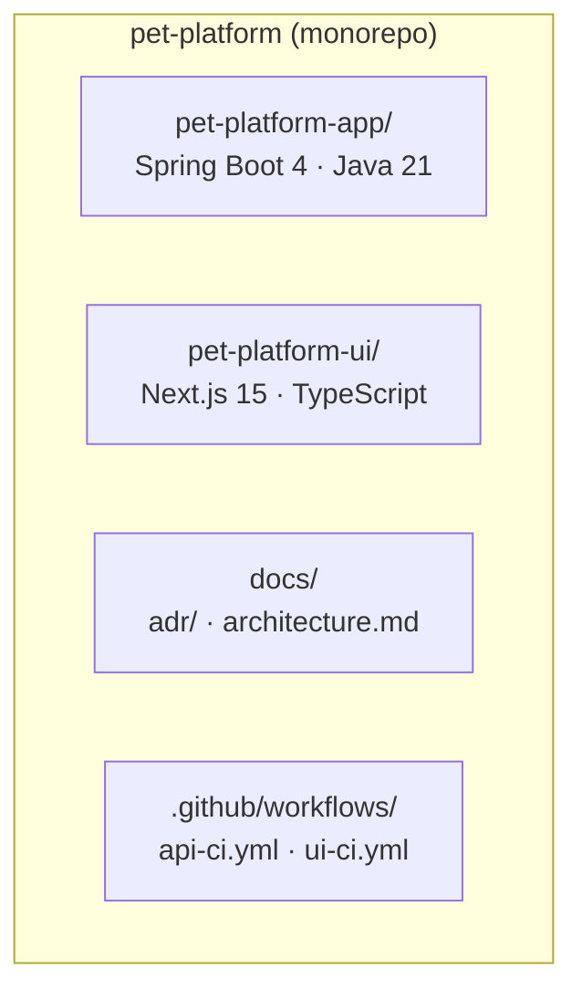
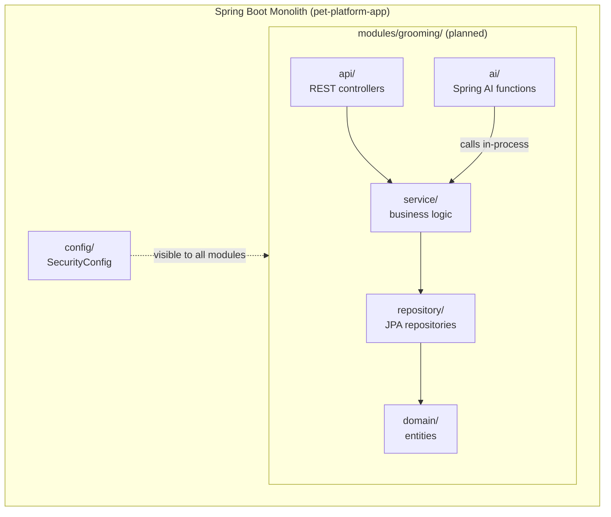
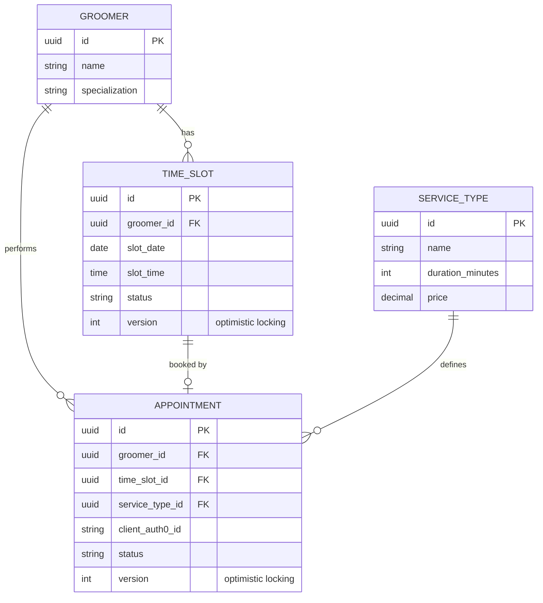
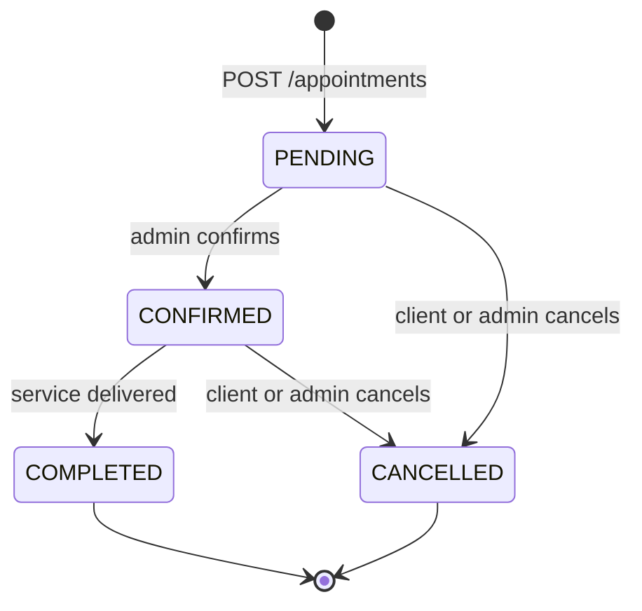
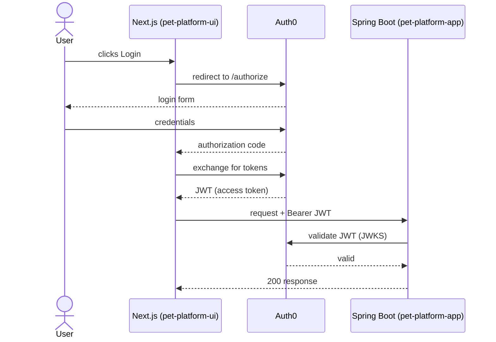
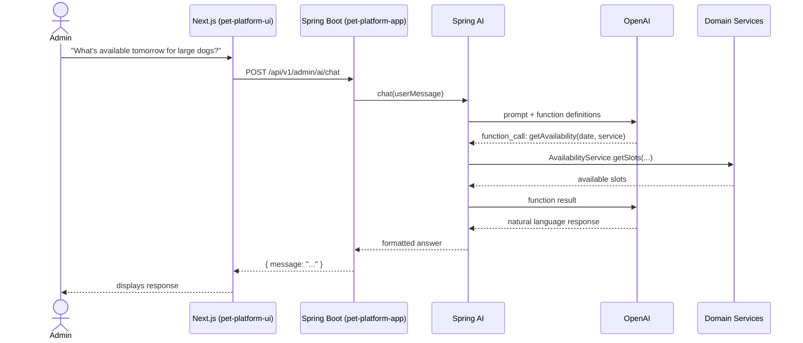

# Pet Platform — Architecture

## Traffic Flow

## Infrastructure

## Repository Structure

## Backend Module Structure

## Domain Model — Grooming Module

## Appointment Status Lifecycle

## Authentication Flow

## AI Chat Flow (Admin)

